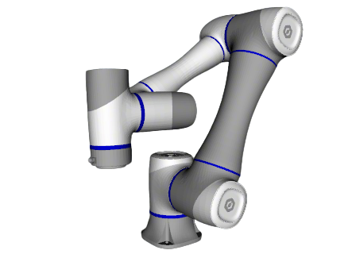
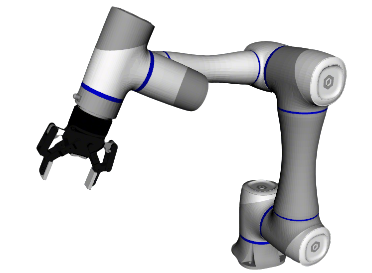

# Dobot Robot Descriptions

This repository contains URDF/Xacro description files for Dobot robotic manipulators, organized as ROS2 packages with high-quality visual meshes.

## Overview

This is a git submodule of the main [robot_descriptions](https://github.com/fiveages-sim/robot_descriptions) repository, containing Dobot robot arm descriptions with enhanced visual models and comprehensive ROS2 integration.

## Supported Robots

| Model | DOF | Repaint | Images |
|-------|-----|---------|--------|
| [CR5](cr5_description/) | 6 | Yes |   |

### Dobot CR5

The CR5 is a 6-DOF collaborative robot arm with:
- **Payload**: 5 kg
- **Reach**: 900 mm
- **Repeatability**: ±0.02 mm
- **Multiple gripper support**: Robotiq 85, ChangingTek AG2F90-C, AG2F120S

## Features

### 🎨 High-Quality Visual Models
- Repainted in Blender for photorealistic visualization
- Optimized collision meshes for accurate physics simulation
- Support for both visual and collision geometries

### 🎮 ROS2 Control Integration
- Full `ros2_control` hardware interface
- Position and effort controllers
- Support for mock components, Gazebo, and real hardware
- Topic-based control for seamless hardware integration

### 🤖 Gripper Support
Compatible with multiple end-effectors:
- **Robotiq 2F-85**: Two-finger adaptive gripper
- **ChangingTek AG2F90-C**: Parallel gripper with soft pads
- **ChangingTek AG2F120S**: Heavy-duty parallel gripper

### 🚀 OCS2 MPC Support
- Mobile manipulator MPC demonstration
- Arm-only MPC controller
- Whole-body optimization for trajectory planning
- Real-time control capabilities

## Quick Start

### Installation

```bash
# Clone the main repository with submodules
cd ~/ros2_ws/src
git clone --recursive https://github.com/fiveages-sim/robot_descriptions

# Or if you already have the main repo, update this submodule
cd ~/ros2_ws/src/robot_descriptions
git submodule update --init manipulator/Dobot

# Build
cd ~/ros2_ws
colcon build --packages-up-to cr5_description --symlink-install
```

### Visualization

```bash
# Basic visualization without gripper
ros2 launch robot_common_launch manipulator.launch.py robot:=cr5

# With Robotiq 85 gripper
ros2 launch robot_common_launch manipulator.launch.py robot:=cr5 type:="robotiq85"

# With ChangingTek AG2F90-C gripper
ros2 launch robot_common_launch manipulator.launch.py robot:=cr5 type:="AG2F90-C"
```

### OCS2 Mobile Manipulator Demo

```bash
ros2 launch robot_common_launch manipulator_ocs2.launch.py robot_name:=cr5
```


### OCS2 Arm Controller

```bash
# Simulation with mock components
ros2 launch ocs2_arm_controller demo.launch.py type:=AG2F90-C-Soft

# Gazebo simulation
ros2 launch ocs2_arm_controller demo.launch.py hardware:=gz type:=AG2F90-C-Soft
```

## Package Structure

```
Dobot/
├── .images/                    # Robot images for documentation
│   ├── dobot_cr5.png
│   ├── dobot_cr5_robotiq85.png
│   ├── dobot_cr5_ag2f90-c.png
│   └── dobot_cr5_ocs2.gif
└── cr5_description/           # CR5 robot package
    ├── config/
    │   ├── ocs2/             # OCS2 MPC configuration
    │   └── ros2_control/     # Controller configuration
    ├── launch/
    │   └── dobot_bringup_ros2.launch.py
    ├── meshes/
    │   ├── collision/        # Collision meshes
    │   └── visual/           # Visual meshes (Blender repainted)
    ├── urdf/
    │   └── cr5.urdf         # Generated URDF
    └── xacro/
        ├── arm.xacro        # Robot arm definition
        ├── grippers.xacro   # Gripper configurations
        ├── robot.xacro      # Main robot file
        └── ros2_control/    # ROS2 control interfaces
```

## Real Hardware Integration

### Requirements
- Dobot CR5 robot arm
- Network connection to robot controller (ensure PC and robot are on the same network)
- `dobot_ros2_control` package (hardware interface)

### Step-by-Step Setup

#### 1. Build Required Packages

First, build all necessary packages before configuration:

```bash
cd ~/ros2_ws

# Build Dobot ROS2 packages
colcon build --packages-up-to dobot_ros2_control --symlink-install

# Build control packages
colcon build --packages-up-to cr5_description ocs2_arm_controller --symlink-install

source install/setup.bash
```

#### 2. Configure Robot Connection Parameters

Edit the ROS2 Control hardware parameters in `cr5_description/xacro/ros2_control/robot.xacro`:

```xml
<xacro:if value="${'$(arg ros2_control_hardware_type)' == 'real'}">
  <plugin>dobot_ros2_control/DobotHardware</plugin>
  <param name="robot_ip">192.168.5.34</param>        <!-- Change to your robot's IP -->
  <param name="gain">800</param>                      <!-- Control gain (default: 800) -->
  <param name="aheadtime">50</param>                  <!-- Lookahead time in ms (default: 50) -->
  <param name="speed_factor">100</param>              <!-- Speed scaling 0-100% (default: 100) -->
  <param name="servo_time">0.5</param>                <!-- Servo update period in seconds -->
</xacro:if>
```

**Parameter Guidelines:**
- `robot_ip`: Set to your Dobot CR5's IP address
- `gain`: Higher values = more responsive but less stable (recommended: 500-1000)
- `aheadtime`: Trajectory lookahead time in milliseconds (recommended: 30-100)
- `speed_factor`: Overall speed scaling percentage (recommended: 50-100 for testing)
- `servo_time`: Control loop period (recommended: 0.5s for smooth motion)

#### 3. Check Robot's Current Position

Before first use, it's crucial to check the robot's current joint positions to set safe default poses.

**Launch the controller temporarily to observe joint positions:**

```bash
# Start the controller (this will activate the hardware connection)
source ~/ros2_ws/install/setup.bash
ros2 launch ocs2_arm_controller demo.launch.py robot:=cr5 hardware:=real

# In another terminal, echo the joint states
ros2 topic echo /joint_states
```

You will see output like:
```yaml
position: [0.0, -0.523, -1.396, 0.0, 1.919, 0.0]  # Example values in radians
```

**Record these positions** - you'll use them to configure safe poses in the next step.

**Recommended Poses to Record:**
- **Home Pose**: A safe, neutral position for initialization (typically all joints at 0° or ready position)
- **Rest Pose**: A compact position for storage (arm folded)

**Stop the controller** (Ctrl+C) after recording the positions, as you need to update the configuration before actual use.

#### 4. Configure Home and Rest Poses

Edit `cr5_description/config/ros2_control/ros2_controllers.yaml` with the recorded positions:

```yaml
ocs2_arm_controller:
  ros__parameters:
    # Set these based on your robot's actual safe positions
    home_pos: [0.0, 0.0, -1.5708, 0.0, 1.5708, 0.0]        # Home position in radians
    rest_pos: [-3.1415926, 0.0, -1.5708, 0.0, 1.5708, 0.0] # Rest position in radians
```

**Tips for Setting Poses:**
- **Home Pose**: Should be reachable from any position without collisions
- **Rest Pose**: Arm should be in a compact, stable configuration
- Units are in **radians** (π ≈ 3.1415926, 90° = π/2 ≈ 1.5708)
- Test movements slowly first by setting `speed_factor: 50` during initial testing

#### 5. Restart and Use the System

After configuring the home and rest poses, **restart** the controller to apply the new settings and begin actual use:

**Important:** Make sure you have updated `home_pos` and `rest_pos` in step 4 before proceeding!

**Launch Command:**
```bash
source ~/ros2_ws/install/setup.bash

# With gripper
ros2 launch ocs2_arm_controller demo.launch.py robot:=cr5 hardware:=real type:=AG2F90-C-Soft

# Without gripper
ros2 launch ocs2_arm_controller demo.launch.py robot:=cr5 hardware:=real type:=empty
```

The system will now use your configured home and rest positions for safe operation.

### Troubleshooting

| Issue | Solution |
|-------|----------|
| Cannot connect to robot | Check IP address, network connection, and firewall settings |
| Robot moves too fast/jerky | Reduce `speed_factor` and `gain` parameters |
| Controller fails to start | Verify `home_pos` and `rest_pos` are within joint limits |
| Trajectory tracking error | Increase `aheadtime` or reduce motion speed |
| Robot doesn't respond | Check if robot is in servo mode and emergency stop is not pressed |

### Safety Notes

⚠️ **Always follow these safety guidelines:**
1. Keep the emergency stop within reach
2. Start with `speed_factor: 10` for initial testing
3. Verify `home_pos` and `rest_pos` are collision-free before first use
4. Monitor the first few movements closely
5. Ensure workspace is clear of obstacles
6. Follow Dobot's safety guidelines and local regulations

See [cr5_description/README.md](cr5_description/README.md) for detailed instructions.

## Dependencies

### ROS2 Packages
- `robot_common_launch` - Common launch files and utilities
- `changingtek_description` / `robotiq_description` / `inspire_description` - Gripper models
- `ros2_control` - Hardware abstraction and control
- `ocs2_ros2` - Optimal control framework (optional, for MPC demos)

### System Requirements
- ROS2 Jazzy or later
- Ubuntu 24.04 or later
- Gazebo (for simulation)
- Isaac Sim (optional, for advanced simulation)

## Documentation

- [CR5 Description Package](cr5_description/README.md) - Detailed documentation for CR5
- [Main Robot Descriptions](https://github.com/fiveages-sim/robot_descriptions) - Parent repository
- [Dobot Official Documentation](https://github.com/Dobot-Arm/DOBOT_6Axis_ROS2_V4) - Original ROS2 package

## Acknowledgments

- Original URDF models from [Dobot-Arm/DOBOT_6Axis_ROS2_V4](https://github.com/Dobot-Arm/DOBOT_6Axis_ROS2_V4)
- Visual mesh improvements and ROS2 integration by the FiveAges team
- Gripper integration support from common robot components

